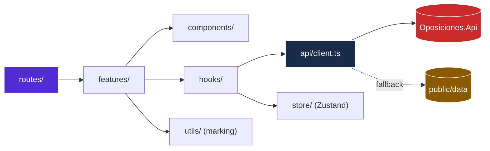

# Simulacros TAI — Web client

[](https://react.dev/)
[](https://www.typescriptlang.org/)
[](https://vite.dev/)
[](docs/README.md)

Exam simulator for the Spanish **TAI** civil service examination (Técnico Auxiliar de
Informática, INAP). It generates practice exams from the official syllabus, marks them under
the official scale, and shows a candidate where their study time is best spent.

It works with no backend at all: reads fall back to a bundled catalogue and attempts are
kept on the device until connectivity returns.

## Features

- **Two modes.** *Study* corrects each answer immediately and explains it. *Exam* mirrors
  the real conditions: a countdown, hidden answers, and the official scale.
- **Exam engine.** One question at a time, a palette showing what is answered, keyboard
  navigation (arrows to move, A–D to answer), and a clock that closes the exam when it
  expires.
- **Official INAP marking.** +1.00 per correct answer, −0.33 per wrong one, 0.00 for a
  blank. Previewed instantly on the device; decided by the server.
- **Performance dashboard.** Average grade, accuracy, per-block breakdown ordered weakest
  first, and the trend over recent exams.
- **Works offline.** Exams sat without signal are queued in IndexedDB and replayed later.
  A reload mid-exam restores the answer sheet and the clock.

## Quick start

```bash
npm install
```

```bash
npm run dev
```

Runs on `http://localhost:5173`. It works without a backend; to connect one, see
[`docs/60-runbook.md`](docs/60-runbook.md).

## Verification

```bash
npm run verify
```

Typecheck, lint, 48 unit tests and the production build. Nothing is considered done until
it passes.

## Architecture



Server data lives in TanStack Query, client state in Zustand, and the network is reached
through exactly one module. Details in [`docs/20-architecture.md`](docs/20-architecture.md).

## Design

The visual language is [naindev.com](https://www.naindev.com)'s, adopted wholesale: the same
tokens, typography, ambient background and component treatments. Both properties are
published under the same identity, so looking like a different product undermines them both.

Typefaces are self-hosted. Every feedback state carries an icon and a border as well as a
hue, the interface is fully keyboard-operable, and decorative motion is skipped for viewers
who ask for that. See [`docs/21-design-system.md`](docs/21-design-system.md).

## Documentation

This repository follows **Spec Driven Development**: every change starts in a document.
Start at [`docs/README.md`](docs/README.md).

- [Charter](docs/00-charter.md) · [Requirements](docs/10-requirements.md) ·
  [Open questions](docs/11-open-questions.md)
- [Architecture](docs/20-architecture.md) · [Design system](docs/21-design-system.md)
- [Decisions](docs/30-decisions/) — five ADRs
- [Tasks](docs/40-tasks.md) · [Blockers](docs/41-blockers.md)
- [Traceability](docs/50-traceability.md) · [Runbook](docs/60-runbook.md) ·
  [Changelog](docs/90-changelog.md)

Agent instructions live in [`AGENTS.md`](AGENTS.md).

## API

The backend is a separate repository:
[SistemaOposicionesTAI](https://github.com/Nain9Dev/SistemaOposicionesTAI) — .NET 10, Clean
Architecture, PostgreSQL. `swagger.json` in this repository is the checked-in record of the
contract.

## Author

Built by [NainDev (Aitor Nain)](https://github.com/Nain9Dev).
