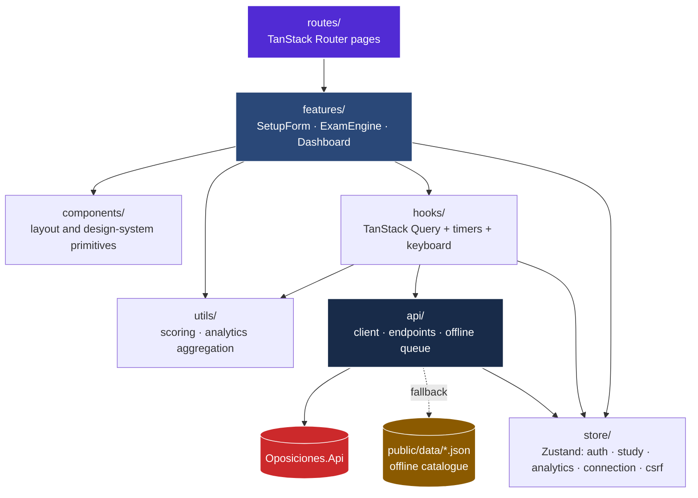
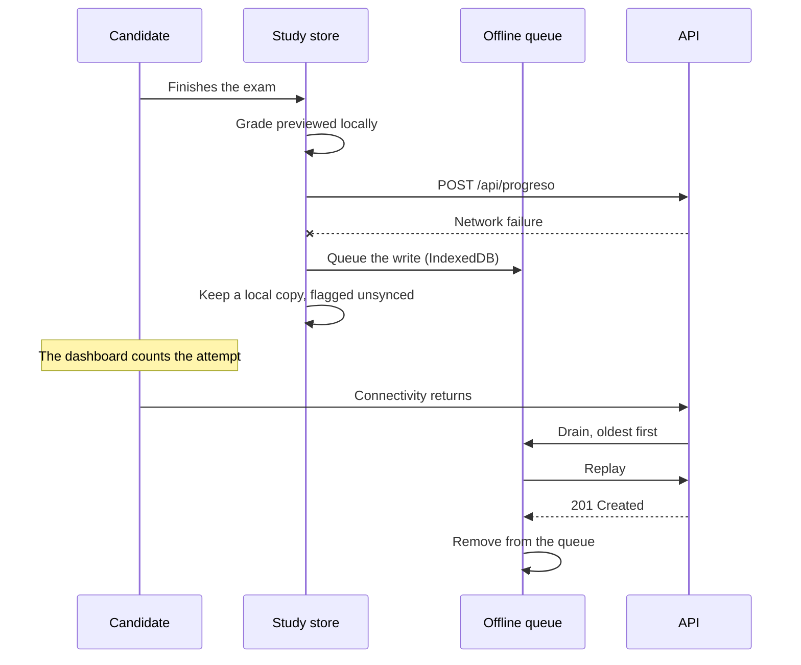

# 20 — Architecture

## Layers

## Who owns which state

Getting this wrong is what produces two components disagreeing about the same fact.

| State | Owner | Why there |
| :--- | :--- | :--- |
| Server data (questions, statistics, history) | TanStack Query | It is a cache of something we do not own. Caching, revalidation and cancellation come free. |
| Exam in progress | `useStudyStore` (sessionStorage) | It is client state with a lifetime: a reload must not lose it, a new tab must not resurrect it. |
| Session profile | `useAuthStore` (localStorage) | Needed before the first paint to decide the route. The cookie is the real session; this is a cache confirmed against `/auth/me`. |
| CSRF token | `useCsrfStore` (localStorage) | Must survive a reload, and the API rotates it. |
| Connection mode and queue depth | `useConnectionStore` | Pushed by the API client. Components subscribe instead of polling. |
| Local attempts | `useAnalyticsStore` (localStorage) | Everything a guest does, plus anything not yet confirmed by the server. |

## The API client

`api/client.ts` is the only place that talks to the network. Everything it does beyond
`fetch` exists for a reason the interface would otherwise have to handle itself:

| Behaviour | Why |
| :--- | :--- |
| Static fallback on a failed `GET` | The GitHub Pages demo has no backend, and candidates study without signal |
| Offline queue on a failed write | An exam sat on a train must not be lost |
| One retry after rotating the session on a 401 | An expired access token is routine, and should not look like being signed out |
| Single-flight rotation | See [ADR-0003](30-decisions/ADR-0003-single-flight-refresh.md) — concurrent rotations get the whole account signed out |
| `ProblemDetails` parsing | The API writes error messages for the end user, in Spanish. Replacing them with our own would be worse |
| Pushing connection state to the store | Removes two polling intervals that could contradict each other |

## Marking

`utils/scoring.ts` mirrors the server's `ScoringService`, pinned to the same constants by
tests in both repositories.

The duplication is deliberate: the candidate sees their grade the moment they press finish,
without waiting for a round trip, and the exam still marks correctly with no API at all.
The server remains authoritative — what it returns is what is stored and what the dashboard
reports. See [ADR-0002](30-decisions/ADR-0002-client-previews-server-decides.md).

## Offline flow

Draining stops at the first network failure rather than burning an attempt on every queued
item, and discards anything the API rejects with a 4xx, since replaying it will never work.

## Deliberate decisions

| Decision | Reason |
| :--- | :--- |
| CSS Modules, not a utility framework | The design language comes from naindev.com, which is hand-written CSS. Tokens transfer directly |
| Zustand alongside TanStack Query | They answer different questions: one caches what the server owns, the other holds what the client owns |
| `sessionStorage` for the exam | A reload must not lose it; a week-old abandoned exam must not come back |
| No generated API client | The hand-written one carries fallback, queueing and rotation that a generator cannot express. Two clients for one API is worse than one — [ADR-0004](30-decisions/ADR-0004-drop-generated-client.md) |
